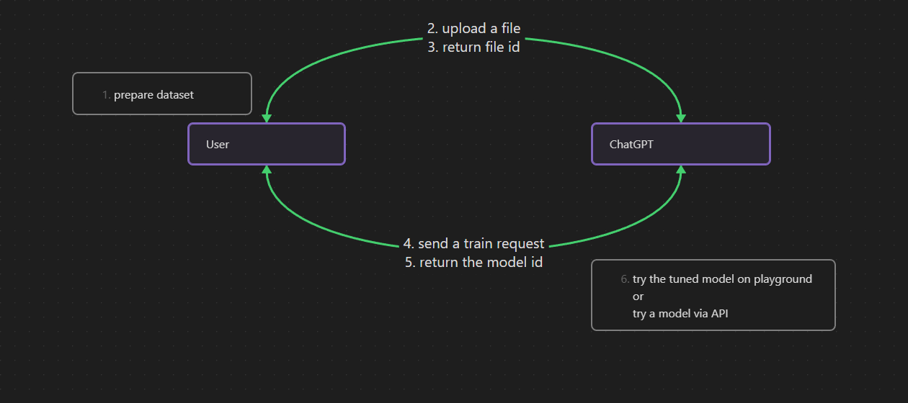

# Fine Tuning API with javascript

https://platform.openai.com/docs/guides/fine-tuning



## steps

1. prepare dataset for the API
2. upload a file
3. return the file id
4. send train request
5. return model id

## Before running the script

Before running the node script, we need to do a couple of things.  
requirements python + nodejs

1. Get OpenAI API Key
   Go to the following url and create a new API key.  
   https://platform.openai.com/account/api-keys  
   Then you need to create `.env` file from `.env.sample` and put the API key you got.

2. Prepare the dataset
   For using OpenAI fine-tuning API, we will need to upload the dataset so first we need to create a file which is a `jsonl`.  
   The format is below.
   sample: [data.jsonl](./sample.jsonl)

```jsonl
{ "prompt": "users' question", "completion": "answer to the question" }

// sample
{ "prompt": "What is the OT-2 Python Protocol API? ", "completion": "The OT-2 Python Protocol API is a Python framework designed to make it easy to write automated biology lab protocols that use the OT-2 robot and optional hardware modules. We’ve designed the API to be accessible to anyone with basic Python and wet-lab skills." }

```

3. Convert the jsonl for the OpenAI API
   Before updating the dataset, we need to optimize the jsonl file for the API. For doing that we need to use the CLI tool from OpenAI.

```zsh
pip install --upgrade openai openai"[datalib]"
```

```zshhttps://github.com/nvm-sh/nvm
openai tools fine_tunes.prepare_data -f your_jsonl_file_path
```

4. Install nodejs (if you don't have nodejs installed) and node package manager
   I recommend to use node version manager such as nvs, nvm and n.

- nvs: https://github.com/jasongin/nvs
- nvm: https://github.com/nvm-sh/nvm

Then install node v16 or later and install npm, yarn or pnpm.

```zsh
# yarn
npm install -g yarn@1

# pnpm
npm install -g pnpm
```

## how to use scripts

1. install npm packages

```zsh
# npm
npm install

# yarn
yarn

# pnpm
pnpm install
```

2. upload jsonl file
   For this step, we will need to call uploader.js. If you don't store jsonl file in this folder, you will need to update the file path.

```zsh
# npm / pnpm
npm run upload
pnpm run upload

# yarn
yarn upload
```

3. send a fine-tuning request
   Once you upload jsonl file successfully, you will see `fileId.js` in your folder.
   There is the file id in `fileId.js`.

```zsh
# npm / pnpm
npm run train
pnpm run train

# yarn
yarn train
```

Once you send a fine-tuning request successfully, you will see 200 response.
Then you will need to wait for a while. The training will take some time. Unfortunately, there is no way to the estimation of the training.

4. check the training status
   To check the training status, you will need to run the following.

```zsh
# npm / pnpm
npm run check-status
pnpm run check-status

# yarn
yarn check-status
```

5. test tuned-model
   Once the train is done, you will see `success` status with the above check command and it will show you the model id.
   There are two ways to test the tuned model. One is using the API via `completion.js` in this folder and the other is [OpenAI playground](https://platform.openai.com/playground).
   Using playground is very easy.

If you want to try your model from `completion.js`, you will need to change two vars.(prompt and model)

```zsh
# npm / pnpm
npm run try-model
pnpm run try-model

# yarn
yarn try-model
```

If you have any questions, please contact to @koji via Slack.
